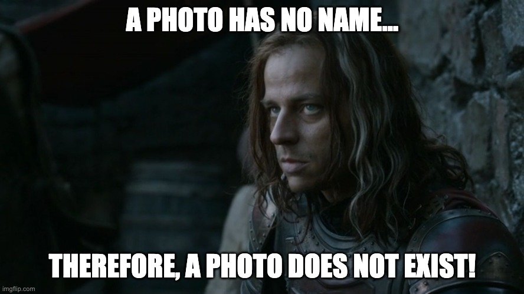

Happy end of summer (if we can be happy about that).

Here are a few updates:
1. I am still sans baby. My partner is not impressed that this child is taking its sweet time. 
2. I am adjusting the syllabus to reflect the current progress and that I am still sans baby. What this means is, simply, I am trying to design the coming weeks to be done both in person and asynchronistic if needed. Please check the website under the syllabus/weekly instructions for updates. 
3. I think we had a fruitful and productive week in addressing som of the issues which lay behind how we define and practice History, Archaeology, Public History and the digital. I am very happy with the class participation. 
4. Please explore (AND USE HYPOTHES.IS) this article [Why men on TikTok say they think a lot about the Roman Empire](https://www.msnbc.com/opinion/msnbc-opinion/men-roman-empire-tiktok-trend-rcna105780) by Sarah Bond and Stephanie Wong. It is relevant to current and future discussions as well as the coming Case Study Week. I will post the link with Case Study Readings.
5. Please have a relaxing and enjoyable weekend and as always, please reach out if you need anything. By now you should have a sense that I am a pretty easy going guy and I want to help you succeed. 

Plus, here is a meme I made about Museums and taking photos. Thoughts?

